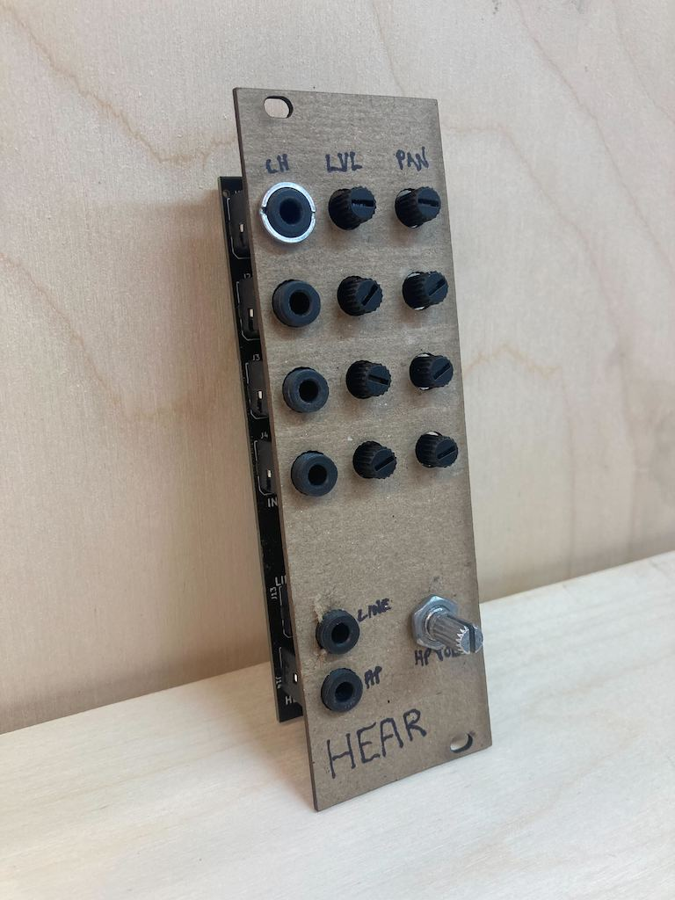
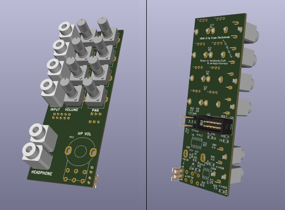

# HEAR

### ⚠️ THIS MODULE WORKS, BUT HASN'T BEEN TESTED THUROUGHLY YET ⚠️

HEAR is a DIY 8hp eurorack module designed to be the output stage of your patches. It has a 4 channel mixer with individual pan and level controls, and line and headphone outputs.

The project was derived from the [Exits](https://github.com/ramphands/Exits) module. Exits was a combination of the lines mixer project [Nearness](https://github.com/sarnesjo/nearness) and the [Forestcaver headphone amp](https://github.com/forestcaver/Analog-Voice/tree/master/AJH_Headphone_Amp). For HEAR The patch-based stereo panning of Exits and nearness was changed out for individual pan and level controls for 4 tracks, and the Forestcaver headphone amp (based on the NJM4556AV-TE1 opamp) was changed out for a headphone amp loosely based on Chu Moy's famous ["CMoy" design](https://web.archive.org/web/20021223020724/http://headwize2.powerpill.org/projects/showproj.php?file=cmoy2_prj.htm) - in this case using the RC4580 instead of the OPA134 for availability and experimentation reasons. The module was expanded from 4hp to 8hp to accomodate the extra knobs. I also switched from 1/4" jacks for the two outputs - to 1/8" jacks for everything. The extra space on the widened input board, along with removing the two tall 1/4" jacks, allowed me to flatten the module from two PCBs to just one.

If you'd like to explore the pan + mix section, circuitjs simulation files are in the [simulations](simulations) directory.

The four mixer channels are DC coupled, so you can use this module to mix CV. The headphone output is not DC coupled, so only the line output will output DC offsets. At maximum volume the headphone output is about 1/10 the input level. J5 and J6 are jumpers - no pins bridged means the mixer has a gain of about 1x. Bridging pins 1 and 2 on both jumpers will set the mixer sections gain to 2/3x in case you're mixing hot signals and want to tone things down a bit. To add gain, you could bridge pins 1+2 and then desolder R17 and R20. That'll set the gain to just shy of 2x.

The following sources were used either directly or as learning material to construct the panning and mixing section:

- [Audio Signal Mixing](https://sound-au.com/articles/audio-mixing.htm) By Rod Elliott - a fantastic explainer of mixing circuits
- Erica Synths DIY eurorack [Output and Mixer](https://github.com/erica-synths/diy-eurorack) modules
- [Befaco Hexmix](http://www.befaco.org/hexmix/)

## Schematic and PCBs

The [kicad](kicad) directory contains the schematic and PCB layout as a KiCad 6 project.

Gerber files are generated by [Bouni's Kicad JLCPCB tools](https://github.com/Bouni/kicad-jlcpcb-tools) - latest files are located in [kicad/jlcpcb](kicad/jlcpcb). These are still untested. This page will be updated when they have been tested and are KNOWN working.

## Panel

The panel for HEAR has been generated by [Crows Eurorack Laser Panels](https://crowselectromusic.com/tools/laser/panels/). The panel definition file is located in the [panel](panel) directory, ypu can use that to generate an SVG or DXF file.

## Revisions and notes 

- Started with this commit of [Exits](https://github.com/ramphands/Exits/tree/e56ce6f3a76ff6dc0b776ba10d0bfae7fea7ace0).
- HEAR's first "complete" post-Exits scheamtic, using passive mixing can be found in the git history [here](https://github.com/crowselectromusic/HEAR/blob/65a9d2693df2f5ae9116ffd591f22e5cf609d3db/exits%20schematic.april12th.pdf). After that I switched to current based mixing, per Rod Elliott's article
- HEAR's first "complete" + "current-based" schematic is [here](https://github.com/crowselectromusic/HEAR/tree/e56ce6f3a76ff6dc0b776ba10d0bfae7fea7ace0).
- Fixed routing so left is on the left and right is on the right, [schematic](https://github.com/crowselectromusic/HEAR/blob/033efc4fa74acb90b556fa5d66f9de59aaeca7dc/exits%20schematic.pdf).

## License

[CC BY-SA 4.0](http://creativecommons.org/licenses/by-sa/4.0/)

To summarize the license linked above - you are free to:

* Share — copy and redistribute the material in any medium or format
* Adapt — remix, transform, and build upon the material
for any purpose, even commercially. 

As long as you abide by the terms of the license which requires:

* Attribution — You must give appropriate credit, provide a link to the license, and indicate if changes were made. You may do so in any reasonable manner, but not in any way that suggests the licensor endorses you or your use.

* ShareAlike — If you remix, transform, or build upon the material, you must distribute your contributions under the same license as the original. 
